# 🏗️ AWLAD ELSAMAN POS - ARCHITECTURE DIAGRAMS

> Comprehensive visual documentation of project structure, data flow, and system architecture

---

## 1. 🎯 SYSTEM ARCHITECTURE OVERVIEW

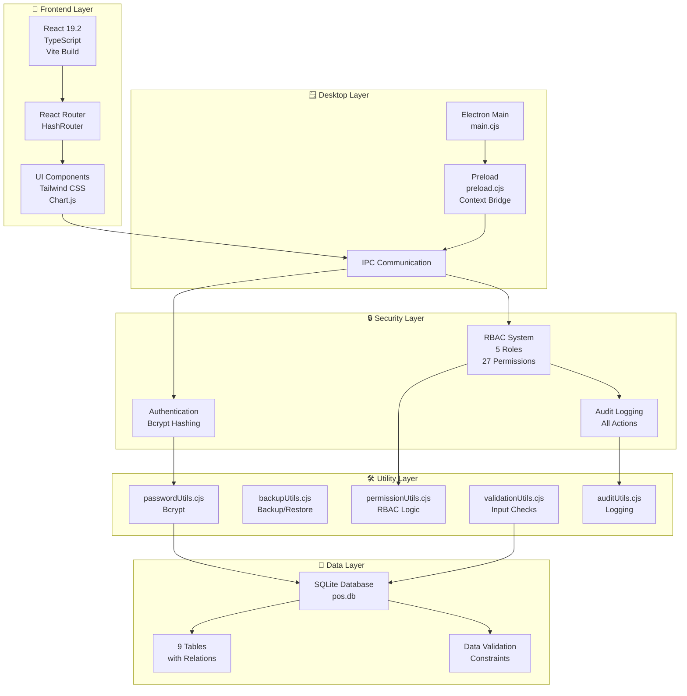

---

## 2. 📊 DATABASE ENTITY RELATIONSHIP DIAGRAM (ERD)

```mermaid
erDiagram
    USERS ||--o{ INVOICES : "creates"
    USERS ||--o{ AUDIT_LOGS : "triggers"
    USERS ||--o{ BACKUPS : "initiates"
    USERS ||--|| PERMISSIONS : "has_role"
    
    PRODUCTS ||--o{ INVOICE_ITEMS : "appears_in"
    PRODUCTS ||--o{ RESERVATIONS : "reserved_as"
    PRODUCTS ||--o{ AUDIT_LOGS : "modified_in"
    
    INVOICES ||--o{ INVOICE_ITEMS : "contains"
    INVOICES ||--o{ PAYMENTS : "receives"
    INVOICES ||--o{ AUDIT_LOGS : "recorded_in"
    
    PERMISSIONS ||--o{ USERS : "defines_access"
    
    USERS : int id PK
    USERS : string username UK
    USERS : string password_hash
    USERS : string email
    USERS : enum role
    USERS : bool is_active
    USERS : timestamp created_at
    
    PRODUCTS : int id PK
    PRODUCTS : string name
    PRODUCTS : string unit
    PRODUCTS : decimal price
    PRODUCTS : int stock
    PRODUCTS : timestamp created_at
    PRODUCTS : timestamp updated_at
    
    INVOICES : int id PK
    INVOICES : string invoice_number UK
    INVOICES : string customer_name
    INVOICES : decimal subtotal
    INVOICES : decimal tax_amount
    INVOICES : decimal total_amount
    INVOICES : decimal paid_amount
    INVOICES : enum status
    INVOICES : timestamp date
    
    INVOICE_ITEMS : int id PK
    INVOICE_ITEMS : int invoice_id FK
    INVOICE_ITEMS : int product_id FK
    INVOICE_ITEMS : string product_name
    INVOICE_ITEMS : int quantity
    INVOICE_ITEMS : decimal unit_price
    INVOICE_ITEMS : decimal line_total
    
    PAYMENTS : int id PK
    PAYMENTS : int invoice_id FK
    PAYMENTS : decimal amount
    PAYMENTS : timestamp date
    
    RESERVATIONS : int id PK
    RESERVATIONS : int product_id FK
    RESERVATIONS : int quantity
    RESERVATIONS : string customer_name
    RESERVATIONS : timestamp expiry_date
    RESERVATIONS : timestamp created_at
    
    AUDIT_LOGS : int id PK
    AUDIT_LOGS : int user_id FK
    AUDIT_LOGS : string action
    AUDIT_LOGS : string table_name
    AUDIT_LOGS : int record_id
    AUDIT_LOGS : string old_value
    AUDIT_LOGS : string new_value
    AUDIT_LOGS : timestamp timestamp
    
    PERMISSIONS : int id PK
    PERMISSIONS : string role
    PERMISSIONS : string permission
    PERMISSIONS : bool can_perform
    
    BACKUPS : int id PK
    BACKUPS : string backup_path
    BACKUPS : int backup_size
    BACKUPS : int created_by FK
    BACKUPS : timestamp created_at
    BACKUPS : timestamp restored_at
    BACKUPS : string description
    
    DATA_VALIDATION_LOGS : int id PK
    DATA_VALIDATION_LOGS : string table_name
    DATA_VALIDATION_LOGS : int record_id
    DATA_VALIDATION_LOGS : string field_name
    DATA_VALIDATION_LOGS : string error_message
    DATA_VALIDATION_LOGS : timestamp created_at
```

---

## 3. 🔐 USER AUTHENTICATION & PERMISSION FLOW

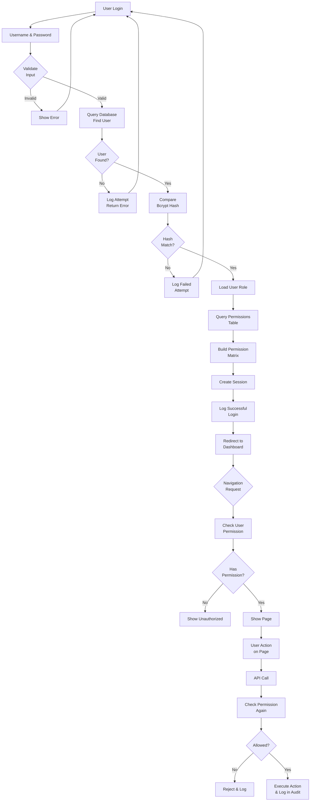

---

## 4. 📝 INVOICE CREATION WORKFLOW

```mermaid
graph LR
    A["POS Page<br/>Load"] --> B["Display<br/>Products"]
    B --> C["User Selects<br/>Product"]
    C --> D["Add to<br/>Invoice"]
    D --> E{"Add More<br/>Items?"}
    E -->|Yes| C
    E -->|No| F["Enter Customer<br/>Name"]
    
    F --> G["Display<br/>Summary"]
    G --> H["Calculate<br/>Subtotal"]
    H --> I["Apply Tax"]
    I --> J["Calculate<br/>Total"]
    
    J --> K["Choose Payment<br/>Type"]
    K --> L{"Payment<br/>Type"}
    
    L -->|Full| M["Enter Payment"]
    L -->|Partial| N["Reserve<br/>Partial"]
    L -->|Reservation| O["Create<br/>48hr Hold"]
    
    M --> P["Validate<br/>Amount"]
    N --> P
    O --> P
    
    P --> Q{"Valid?"}
    Q -->|No| R["Show Error"]
    R --> K
    
    Q -->|Yes| S["Deduct Stock"]
    S --> T["Create Invoice<br/>in Database"]
    T --> U["Create Invoice<br/>Items"]
    U --> V["Create Payment<br/>Record"]
    V --> W["Log in<br/>Audit Trail"]
    W --> X["Generate<br/>Invoice #"]
    X --> Y["Show Success<br/>& Print"]
    Y --> Z["Clear Form<br/>Ready for Next"]
```

---

## 5. 📂 PROJECT FILE STRUCTURE WITH DEPENDENCIES

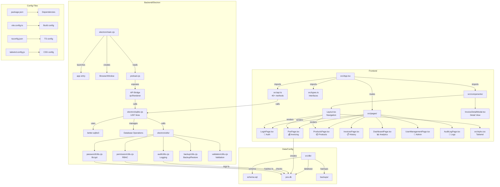

---

## 6. 🔄 DATA FLOW: LOGIN TO DASHBOARD

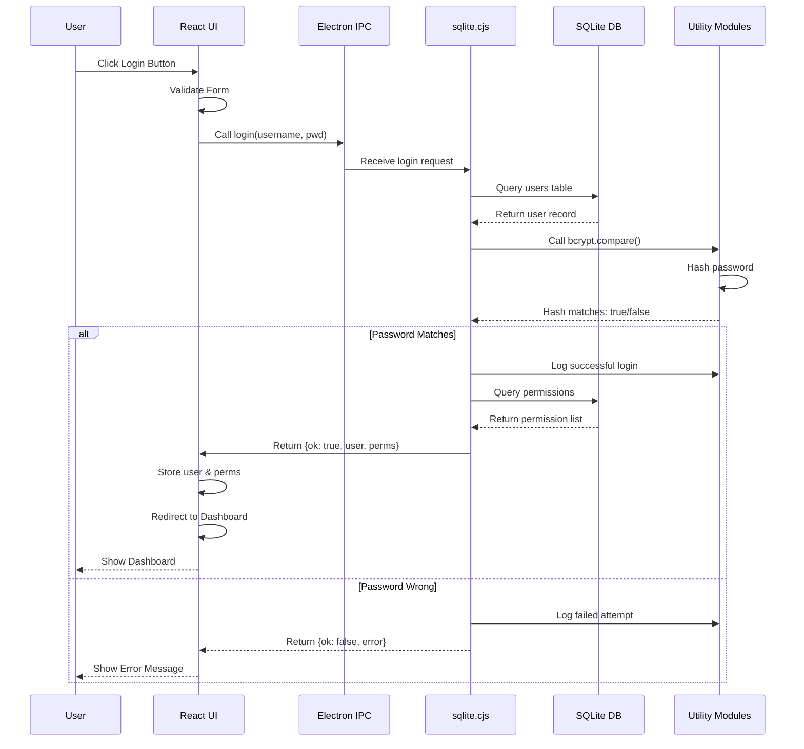

---

## 7. 🔄 DATA FLOW: INVOICE CREATION

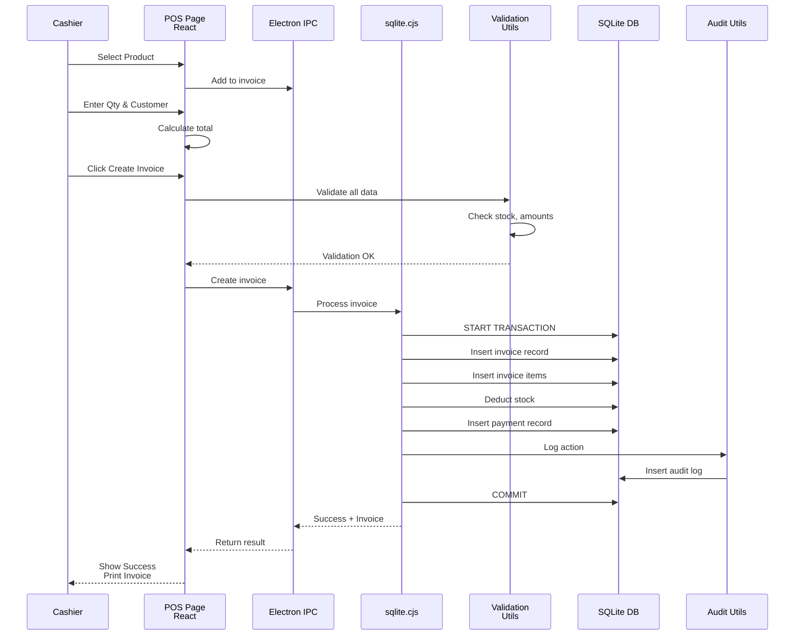

---

## 8. 🎭 USER ROLES & PERMISSIONS MATRIX

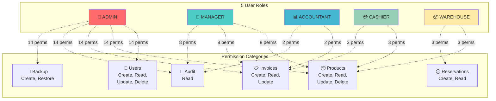

---

## 9. 🛡️ SECURITY LAYERS

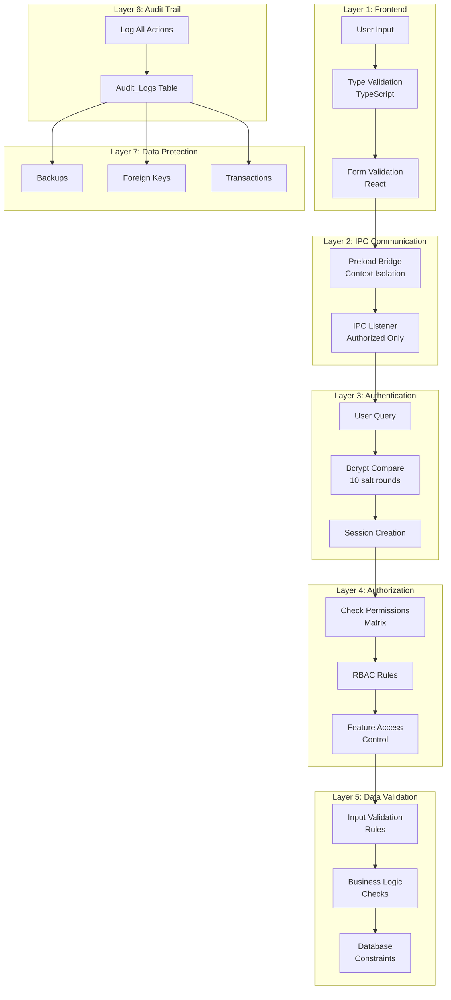

---

## 10. 📈 COMPONENT HIERARCHY

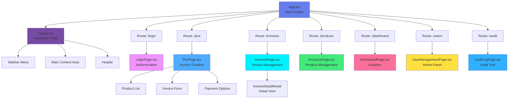

---

## 11. 🔧 ELECTRON PROCESS FLOW

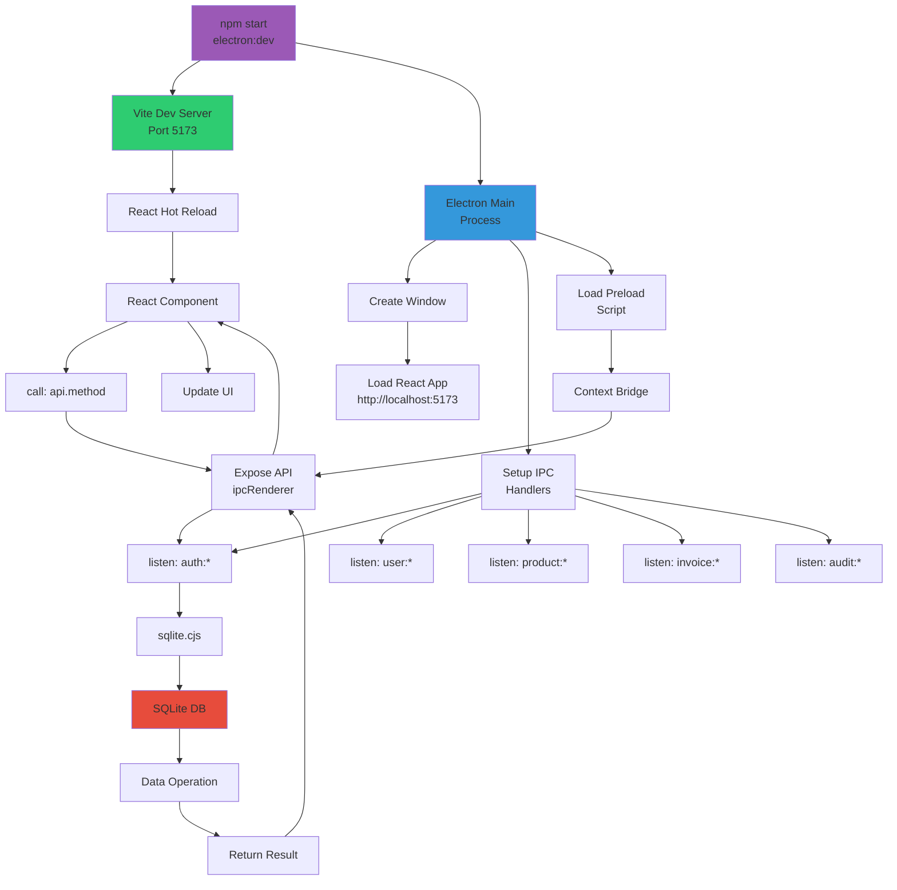

---

## 12. 🚀 BUILD & DEPLOYMENT FLOW

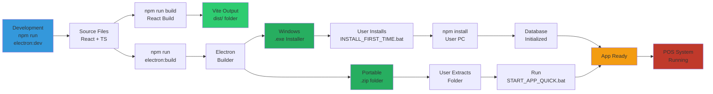

---

## 13. 🗂️ FOLDER STRUCTURE WITH LAYER MAPPING

```mermaid
graph TD
    ROOT["ReactPos/"]
    
    ROOT --> SRC["src/<br/>Frontend Layer"]
    SRC --> PAGES["pages/"]
    PAGES --> P1["LoginPage.tsx"]
    PAGES --> P2["PosPage.tsx"]
    PAGES --> P3["ProductsPage.tsx"]
    PAGES --> P4["InvoicesPage.tsx"]
    PAGES --> P5["DashboardPage.tsx"]
    PAGES --> P6["UserManagementPage.tsx"]
    PAGES --> P7["AuditLogPage.tsx"]
    
    SRC --> COMP["components/"]
    COMP --> C1["Layout.tsx"]
    COMP --> C2["InvoiceDetailModal.tsx"]
    
    SRC --> CORE["Core Files"]
    CORE --> APP["App.tsx"]
    CORE --> API["api.ts<br/>40+ methods"]
    CORE --> TYPES["types.ts<br/>Interfaces"]
    CORE --> STYLE["style.css"]
    
    SRC --> DB["db/"]
    DB --> SCHEMA["schema.sql<br/>9 tables"]
    DB --> POSDB["pos.db<br/>SQLite"]
    DB --> BACKUPS["backups/"]
    
    ROOT --> ELECTRON["electron/<br/>Desktop Layer"]
    ELECTRON --> MAIN["main.cjs"]
    ELECTRON --> PRELOAD["preload.cjs"]
    ELECTRON --> SQLITE["sqlite.cjs<br/>1297 lines"]
    
    ELECTRON --> UTILS["utils/<br/>Utility Layer"]
    UTILS --> U1["passwordUtils.cjs"]
    UTILS --> U2["auditUtils.cjs"]
    UTILS --> U3["permissionUtils.cjs"]
    UTILS --> U4["backupUtils.cjs"]
    UTILS --> U5["validationUtils.cjs"]
    
    ROOT --> DIST["dist/<br/>Built App"]
    DIST --> INDEX["index.html"]
    DIST --> ASSETS["assets/"]
    
    ROOT --> CONFIG["Configuration"]
    CONFIG --> PJ["package.json"]
    CONFIG --> TS["tsconfig.json"]
    CONFIG --> VITE["vite.config.ts"]
    CONFIG --> TAIL["tailwind.config.js"]
    
    style SRC fill:#3498db
    style ELECTRON fill:#e74c3c
    style UTILS fill:#f39c12
    style DB fill:#27ae60
    style CONFIG fill:#9b59b6
```

---

## 14. 📊 STATE MANAGEMENT FLOW

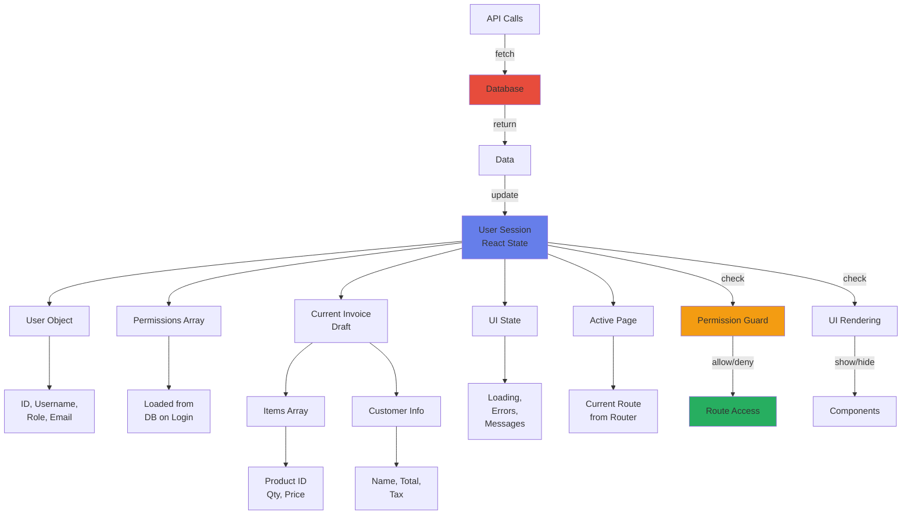

---

## 15. 🔍 DEBUG & TROUBLESHOOTING REFERENCE

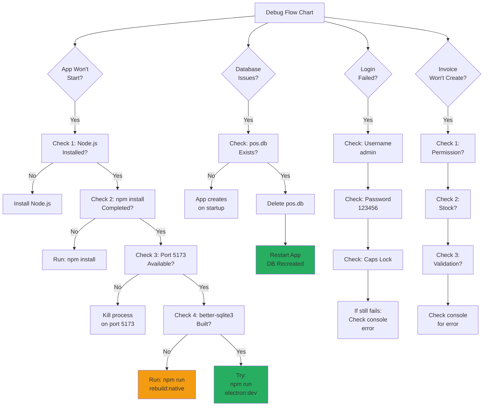

---

## 📋 QUICK LEGEND

| Symbol | Meaning |
|--------|---------|
| 🔐 | Security/Authentication |
| 💾 | Database/Storage |
| 📱 | Frontend/UI |
| 🪟 | Desktop/Electron |
| 🔧 | Utilities/Tools |
| 📊 | Data/Analytics |
| ⚙️ | Configuration |
| 🚀 | Deployment/Build |

---

## 🎯 HOW TO USE THESE DIAGRAMS

### For Development:
1. Reference **Diagram 1** (Architecture) for system overview
2. Check **Diagram 2** (ERD) when working with database
3. Use **Diagram 6** & **7** (Data Flow) when debugging
4. Reference **Diagram 12** (Build Flow) when deploying

### For Debugging:
1. Start with **Diagram 15** (Troubleshooting)
2. Use **Diagram 6** (Auth Flow) for login issues
3. Use **Diagram 7** (Invoice Flow) for data problems
4. Check **Diagram 11** (Electron) for app startup issues

### For New Features:
1. Use **Diagram 5** (File Structure) to find where to add files
2. Check **Diagram 10** (Component Hierarchy) for UI placement
3. Reference **Diagram 2** (ERD) for database changes
4. Update **Diagram 8** (Permissions) if new roles needed

### For Onboarding:
1. Start with **Diagram 1** (Overview)
2. Then **Diagram 8** (Roles)
3. Then **Diagram 6** & **7** (Workflows)
4. Reference **Diagram 13** (Folder Structure)

---

**Last Updated**: April 20, 2026  
**Version**: Phase 1.0 Complete  
**Status**: Production Ready

